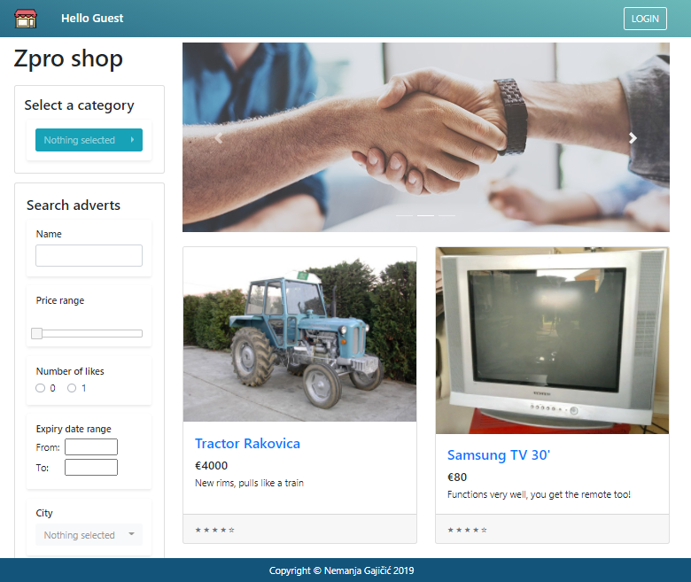
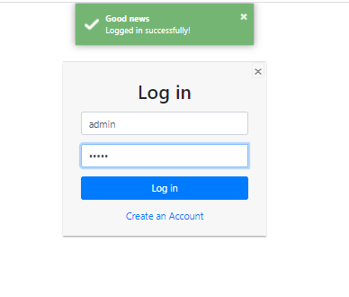
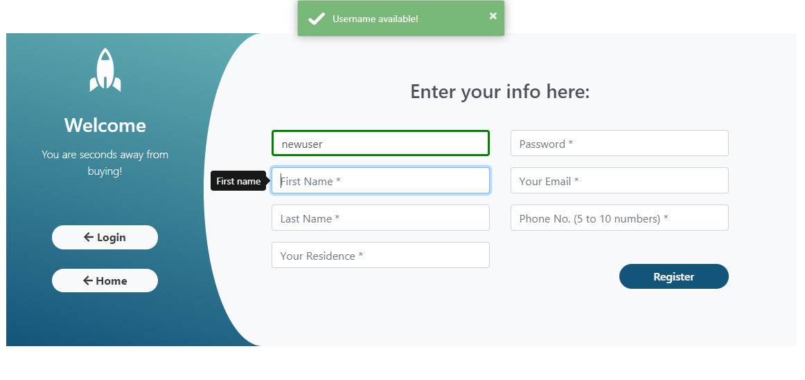
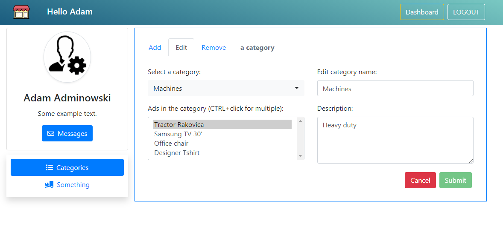
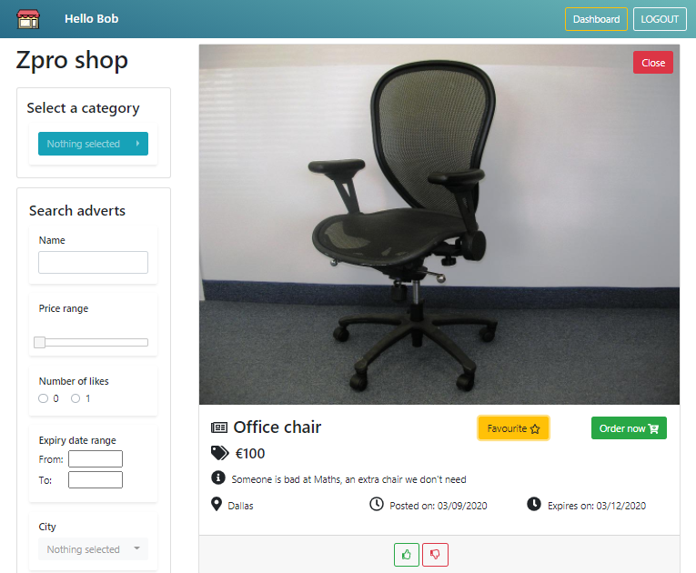
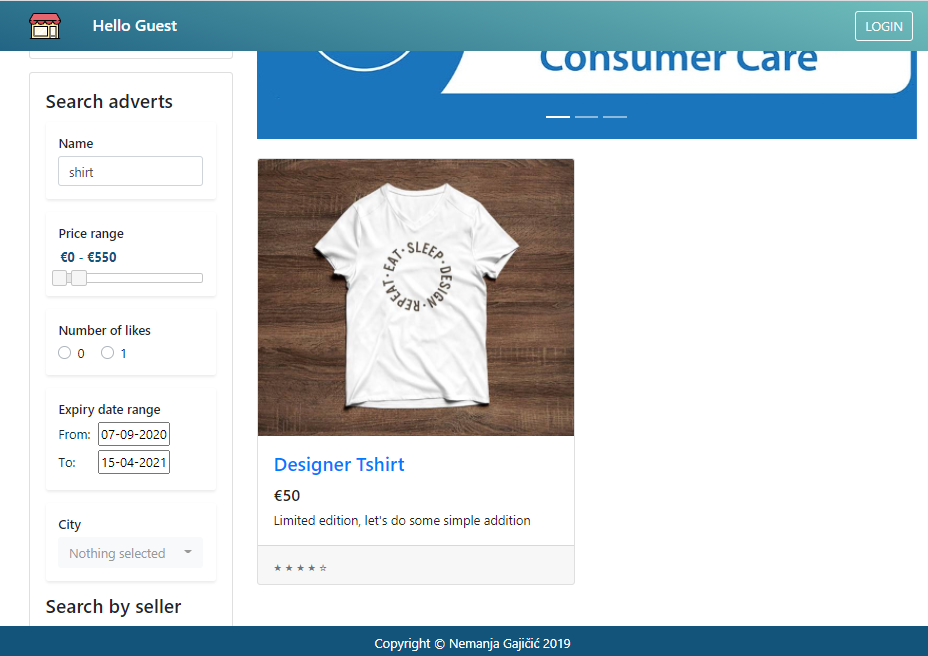

# E-commerce-mini-website

### A 2019 project for web programming university course

### Technologies used: 
- **Backend :**  Java2EE ( RESTFull Services - Jersey, JAX-WS ) + Apache Tomcat  
- **Frontend :**  JSP + JavaScript (JQuery) + CSS (& Bootstrap 4 )
> No, it wasn't written in 2007 (with Bootstrap smuggled via time machine)

### Summary
Users can browse and filter the ads on the site and they can log in or register if they feel so inclined. A registered user can have one of the three roles:  
1) A buyer ( test username,password: buyer ) who can favourite the adverts they like 
2) A seller ( test username,password: seller) - priviledges to be implemented 
3) An administrator ( test username,password: admin ) who can add/remove/edit the product categories 

**Important facts :**
* The backend saves the data in textual files in JSON format 
* No time was spent on security, so there's no password hashing, etc. 

#### How to run it: 
1. Download [ApacheTomcat](https://tomcat.apache.org/) and unzip/install it ( preferably version 7, since I used it )
2. Place the .war file in the *webapps* folder of the Tomcat 
3. Open the *bin* folder and start the **startup.bat** script on Windows / **sh catalina.sh run** on Linux 
4. Open your browser and navigate to : *localhost:8080/Zproject* ( **Don't run the AdBlocker on this page**) 

#### Functionalities to be implemented : 
- [ ] Ordering products 
- [ ] Posting new ads 
- [ ] Message exchange system 
etc. 

#### Screenhsots: 

* *Homepage*

* *Login form*

* *Registration form*

* *Administrator dashboard*

* *Opening an ad as a buyer*

* *Filtering the products on the home page*

